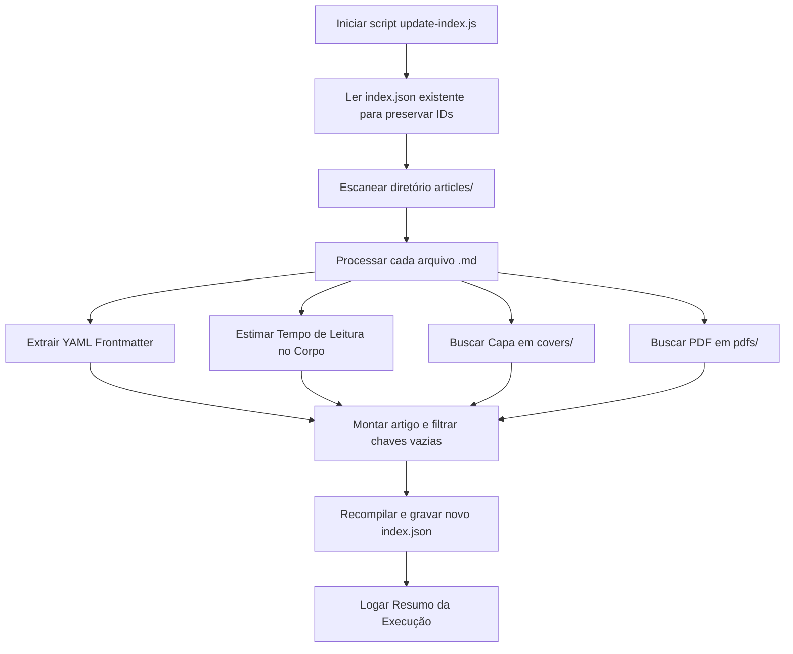

# Arquitetura e Funcionamento do Projeto

Este repositório foi concebido para o armazenamento, organização e distribuição automatizada de artigos científicos e acadêmicos. Através de um script automatizado em Node.js, os metadados dos artigos escritos em Markdown são extraídos e centralizados em um arquivo `index.json`.

---

## 🏗️ Estrutura do Projeto

O repositório é organizado de forma modular para separar conteúdo de texto, mídia (capas), documentos originais e automações:

```text
md-academics/
├── articles/            # Artigos em formato Markdown (.md)
├── covers/              # Imagens de capa associadas aos artigos (.webp, .png, etc.)
├── pdfs/                # Arquivos PDF originais dos artigos (.pdf)
├── scripts/             # Automações e testes do repositório
│   ├── update-index.js  # Script principal de indexação e compilação do index.json
│   └── test-index.js    # Suíte de testes unitários das automações
├── docs/                # Documentação interna sobre o funcionamento do projeto
│   └── arquitetura.md   # Detalhes de arquitetura (este arquivo)
├── index.json           # Registro compilado de todos os artigos e seus metadados
└── README.md            # Guia geral do projeto e contribuição
```

---

## ⚙️ Processo de Indexação e Automação

O script [update-index.js](scripts/update-index.js) é executado no ambiente Node.js. Ele realiza as seguintes operações ordenadamente:



### 1. Preservação de IDs de Artigos
Para garantir consistência e evitar que links e integrações de terceiros quebrem, o script lê o [index.json](index.json) anterior e mapeia os `id`s existentes aos seus respectivos arquivos de origem. Novos arquivos recebem um ID sequencial incremental (ex: `art_003`).

### 2. Extração de Metadados (YAML Frontmatter)
Os metadados no topo do arquivo de markdown (delimitados por `---`) são processados. As chaves suportadas incluem dados bibliográficos e de catalogação científica:
* Identificação: `title`, `author`, `authors`, `summary`, `date`, `categories`.
* Acadêmicos: `doi` (Digital Object Identifier), `udc` (Universal Decimal Classification), `bbk` (Bibliographical classification), `hos` (History of Science ID).
* Direitos Autorais: `license` (ou `licence`).

### 3. Estimativa de Tempo de Leitura
O tempo de leitura é calculado dividindo a contagem de palavras do corpo do artigo pela velocidade média de leitura acadêmica/científica (**200 palavras por minuto**). 
Para uma estimativa mais fiel, o script limpa do corpo do texto:
* Blocos de código e comandos em linha (`code blocks`).
* Tags HTML brutas.
* Formatações de markdown adicionais (títulos, negritos, links).

### 4. Associação de Imagens de Capa (Covers)
O script verifica se existe uma imagem correspondente na pasta `covers/` com o mesmo nome do artigo. Ele suporta as extensões comuns: `.webp`, `.png`, `.jpg`, `.jpeg` e `.svg`.
* Se encontrada, gera a URL direta com a extensão correta.
* Caso não seja encontrada, gera a URL assumindo o padrão `.webp` e exibe um alerta (`Warning`) informando a ausência do arquivo físico.

### 5. Associação do PDF Original
Se houver um arquivo PDF na pasta `pdfs/` com o mesmo nome base do arquivo `.md`, o script adiciona o campo `pdf_url` apontando para o arquivo no repositório.

### 6. Filtragem de Valores Vazios
Para economizar banda e armazenamento na entrega do JSON do catálogo, qualquer chave que não possua valor preenchido (ou seja, contendo `null`, `undefined`, string vazia `""` ou array vazio `[]`) é totalmente eliminada da entrada daquele artigo no [index.json](index.json).
