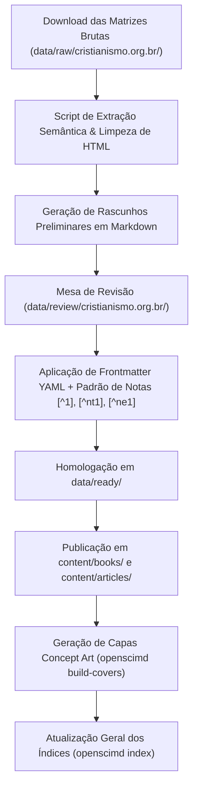

# Plano de Digitalização & Conversão de Obras: cristianismo.org.br

> **Documento de Planejamento Editorial, Mapeamento de Corpus e Engenharia de Conversão**  
> *Fonte de Origem:* [cristianismo.org.br](https://www.cristianismo.org.br/) | *Índice Geral:* [`sumary.htm`](https://www.cristianismo.org.br/sumary.htm)  
> *Destino no Acervo:* `data/raw/cristianismo.org.br/` $\rightarrow$ `content/books/` e `content/articles/`  
> *Regime de Licenciamento:* **CC BY-NC 4.0** (Reprodução Livre para Fins Não Comerciais Autorizada na Origem)

---

## 1. Visão Geral do Projeto

O portal *cristianismo.org.br* preservou um dos mais ricos acervos em língua portuguesa de **textos patrísticos, tratados da Escola de São Vítor de Paris, teologia escolástica medieval e mística cristã clássica**, originalmente codificados em HTML legado dos anos 1990/2000 (layout em tabelas, fontes estáticas e tags legadas).

O objetivo deste projeto é:
1. **Baixar e arquivar a totalidade das matrizes brutas** em `data/raw/cristianismo.org.br/` para preservação digital perene.
2. **Sanear, reformatar e estruturar cada obra em Markdown semântico OpenSciMD** com Frontmatter YAML, aparato crítico de notas de rodapé (`[^1]` para autor, `[^nt1]` para tradutor, `[^ne1]` para notas editoriais) e tipografia padronizada.
3. **Publicar os e-books e tratados** no acervo oficial e no aplicativo **LeiaME**, acompanhados de capas conceituais em 2D *flat art* e metadados completos.

---

## 2. Inventário Estruturado do Acervo por Núcleos Temáticos

O acervo contém **212 páginas e tratados** distribuídos nos seguintes eixos:

### 📜 Núcleo 1: Patrística & Padres do Deserto

| Autor | Obra / Tratado | Arquivos-Fonte (HTML) | Formato Proposto no OpenSciMD |
| :--- | :--- | :--- | :--- |
| **Santo Inácio de Antioquia** | *Epístolas às Sete Igrejas* (Efésios, Magnésios, Tralianos, Romanos, Filadelfos, Esmirnenses e a Policarpo) | `inacio-0.htm` a `inacio-7.htm` | `content/books/inacio-de-antioquia/cartas.md` |
| **Santo Antão do Deserto** | *Sentenças e Cartas Espirituais* + *Vida de Santo Antão* (por Santo Atanásio) | `sentenca-antao.htm`, `sentencas-antao.htm`, `vida-antao.htm` | `content/books/antao-do-deserto/sentencas-e-vida.md` |
| **Orígenes de Alexandria** | *Tratado sobre os Primeiros Princípios (De Principiis)* — Prólogo e Livro IV | `or-prin0.htm` a `or-prin4.htm` | `content/books/origenes/de-principiis-livro-4.md` |
| **São Dionísio Areopagita** | *A Hierarquia Celeste* | `dionisio-hierarquiaceleste.htm` | `content/books/dionisio-areopagita/a-hierarquia-celeste.md` |
| **Santo Atanásio de Alexandria** | *A Criação e a Queda* | `at-fall.htm` | `content/articles/atanasio-a-criacao-e-a-queda.md` |
| **São João Crisóstomo** | *Tratado sobre o Sacerdócio* (Livros I a VI) | `sacerdotio0.htm` a `sacerdotio6.htm` | `content/books/joao-crisostomo/sobre-o-sacerdocio.md` |
| **São João Crisóstomo** | *Contra os Impugnadores da Vida Monástica* (Livros I a III) | `contraimpugnatores0.htm` a `3.htm` | `content/books/joao-crisostomo/contra-os-impugnadores-da-vida-monastica.md` |
| **São João Crisóstomo** | *Sobre a Vanglória e a Educação dos Filhos* | `vangloriaeducacao0.htm` a `3.htm` | `content/books/joao-crisostomo/sobre-a-educacao-dos-filhos.md` |
| **São João Cassiano** | *Conferências dos Padres do Deserto* (I: O Escopo do Monge; XIV: A Ciência Espiritual) | `m-cass00.htm`, `m-cass01.htm`, `m-cass14.htm` | `content/books/joao-cassiano/conferencias-escolhidas.md` |
| **São Bento de Núrsia** | *A Santa Regra dos Monges* (73 Capítulos) + *Vida de São Bento* (por São Gregório Magno) | `regra-00.htm` a `regra-73.htm`, `vidabento.htm` | `content/books/bento-de-nursia/regra-de-sao-bento.md` |

---

### 🏛️ Núcleo 2: A Escola Vitorina (Hugo e Ricardo de São Vítor)

| Autor | Obra / Tratado | Arquivos-Fonte (HTML) | Formato Proposto no OpenSciMD |
| :--- | :--- | :--- | :--- |
| **Hugo de São Vítor** | *A Pedagogia da Sabedoria / Da Arte de Ler* (Comentários e Didascalicon) | `pedggvit.htm`, `pfp-00.htm` a `pfp-04.htm`, `efp1-0.htm` a `efp10-0.htm` | `content/books/hugo-de-sao-vitor/da-arte-de-ler-e-pedagogia.md` |
| **Hugo de São Vítor** | *A Palavra de Deus* (*De Verbo Dei*) | `h-verb.htm` | `content/articles/hugo-de-sao-vitor-a-palavra-de-deus.md` |
| **Hugo de São Vítor** | *A Substância do Amor* (*De Substantia Dilectionis*) | `h-subsam.htm` | `content/articles/hugo-de-sao-vitor-a-substancia-do-amor.md` |
| **Hugo de São Vítor** | *Tratado sobre a Arca de Noé* (Mística e Eclesiologia) | `h-arcanoe-ind.htm` a `h-arcanoe-4.htm` | `content/books/hugo-de-sao-vitor/tratado-sobre-a-arca-de-noe.md` |
| **Hugo de São Vítor** | *Anotações sobre a Epístola aos Romanos* | `h-rom00.htm` a `h-rom16.htm` | `content/books/hugo-de-sao-vitor/comentario-epistola-aos-romanos.md` |
| **Hugo de São Vítor** | *Anotações sobre o Salmo 118* | `h-m26779.htm` | `content/articles/hugo-de-sao-vitor-salmo-118.md` |
| **Hugo de São Vítor** | *Corpus de Sermões Vitorinos* (Sermões 1 a 70+) | `sermo-00.htm` a `sermo-70.htm` | `content/books/hugo-de-sao-vitor/sermoes-escolhidos.md` |
| **Ricardo de São Vítor** | *Benjamin Maior* (Da Graça da Contemplação) | `r-benmaj.htm` | `content/books/ricardo-de-sao-vitor/benjamin-maior.md` |
| **Ricardo de São Vítor** | *Tratado sobre a Santíssima Trindade* (Livro III) | `r-trintt.htm` | `content/books/ricardo-de-sao-vitor/da-santissima-trindade.md` |
| **Ricardo de São Vítor** | *Comentário ao Cântico dos Cânticos* | `cant-ind.htm` a `cant-06.htm` | `content/books/ricardo-de-sao-vitor/comentario-cantico-dos-canticos.md` |
| **Ricardo de São Vítor** | *Os Quatro Graus da Consumação da Caridade* | `rsv-consumacao0.htm` | `content/articles/ricardo-de-sao-vitor-quatro-graus-da-caridade.md` |
| **Maurício & Gualter** | *Sermões Vitorinos Clássicos* | `mauricio.htm`, `gualter.htm` | `content/articles/sermoes-vitorinos-mauricio-e-gualter.md` |

---

### ✝️ Núcleo 3: Escolástica, Mística & Teologia Sistemática

| Autor | Obra / Tratado | Arquivos-Fonte (HTML) | Formato Proposto no OpenSciMD |
| :--- | :--- | :--- | :--- |
| **Santo Anselmo de Cantuária** | *Cur Deus Homo* (*Por que Deus se fez Homem?*) | `m-curhom.htm` | `content/books/anselmo-de-cantuaria/cur-deus-homo.md` |
| **São Bernardo de Claraval** | *A Conversão de São Bernardo* | `bernardo.htm` | `content/articles/bernardo-de-claraval-a-conversao.md` |
| **Santo Tomás de Aquino** | *Opúsculos sobre a Caridade, Contemplação e Virtudes Infusas* | `charitas.htm`, `st-3sn25.htm`, `v-infusa.htm`, `tom-paul.htm` | `content/books/tomas-de-aquino/opusculos-teologicos.md` |
| **Santo Tomás de Aquino** | *Tratado sobre a Providência Divina* | `provid00.htm` a `provid07.htm` | `content/books/tomas-de-aquino/a-providencia-divina.md` |
| **São Roberto Belarmino** | *A Monarquia Eclesiástica do Romano Pontífice* | `bellarmino0.htm` a `7.htm` | `content/books/roberto-belarmino/a-monarquia-eclesiastica.md` |
| **Santa Catarina de Sena** | *A Cela Interior* | `catarina-celainterior.htm` | `content/articles/catarina-de-sena-a-cela-interior.md` |
| **São Pedro de Alcântara** | *Avisos para o Exercício da Meditação* | `pedroalcantara.htm` | `content/articles/pedro-de-alcantara-avisos-de-meditacao.md` |
| **Santo Afonso de Ligório** | *Teologia Moral: O Amor aos Inimigos e aos Pais* | `afonsomorala0.htm` a `4.htm` | `content/books/afonso-de-ligorio/teologia-moral-do-amor.md` |
| **Pe. Antonio Royo Marín** | *Os Graus da Oração* | `royomarin-oracao-0.htm` a `4.htm` | `content/books/royo-marin/os-graus-da-oracao.md` |
| **Pe. V. Stroppa** | *A União com Deus, a Oração, o Estudo e o Silêncio* | `vstroppa.htm` | `content/articles/v-stroppa-a-uniao-com-deus.md` |

---

## 3. Pipeline de Execução Técnica



### 3.1 Padrão de Metadados YAML Obrigatório:

```yaml
---
title: "Título em Português"
authors:
  - name: "Nome do Autor Canônico"
translator: "Equipe Editorial cristianismo.org.br"
license: "CC BY-NC 4.0"
date: "YYYY-MM-DD"
categories:
  - Teologia
  - Patrística # ou Escolástica / Mística
language: "pt-BR"
---
```

### 3.2 Padrão de Aparato Crítico Pós-Texto:
```markdown
---

### Notas Editoriais

[^ne1]: **Proveniência do Texto**: Esta edição em Markdown semântico foi compilada e revisada para o OpenSciMD e o leitor LeiaME a partir do texto digitalizado e traduzido originalmente por *cristianismo.org.br*, sob licença livre não comercial.
```
