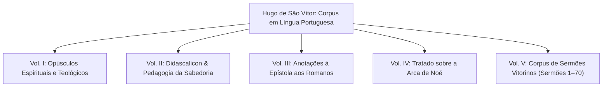

# Roadmap Editorial: Coleção de Obras de Hugo de São Vítor

> **Plano Mestre de Digitalização, Estruturação e Publicação da Escola Vitorina**  
> *Autor:* Hugo de São Vítor (c. 1096 – 1141) | *Canônicos Regulares de São Vítor de Paris*  
> *Destino:* `content/books/hugo-de-sao-vitor/` | *Formato:* OpenSciMD / LeiaME e-book

---

## 1. Visão Geral da Coleção

Hugo de São Vítor (*Magister Hugo de Sancto Victore*), cognominado o "segundo Santo Agostinho" e "língua de Santo Agostinho", fundou as bases metodológicas, pedagógicas e místicas da florescente Escola de São Vítor na Paris do século XII. A presente coleção no OpenSciMD visa reunir, em edições digitais críticas e saneadas, a totalidade de suas obras traduzidas para a língua portuguesa.

---

## 2. Estrutura dos Volumes

### 📖 Volume I: *Opúsculos Espirituais e Teológicos* (EM EXECUÇÃO)
* **Slug**: `opusculos-espirituais`
* **Local de Destino**: `content/books/hugo-de-sao-vitor/opusculos-espirituais.md`
* **Fontes Originais**: `h-verb.htm`, `h-subsam.htm`, `h-m26779.htm`, `gn-hsvta.htm`
* **Conteúdo**:
  1. *Genealogia Espiritual de Hugo de São Vítor e Santo Tomás de Aquino* (Estudo Introdutório)
  2. *A Palavra de Deus* (*De Verbo Dei*)
  3. *A Substância do Amor* (*De Substantia Dilectionis*)
  4. *Anotações sobre o Salmo 118* (*In Psalmum CXVIII*)
* **Aparato Crítico**: Notas editoriais sobre o contexto da Abadia de São Vítor e proveniência do texto.

---

### 📖 Volume II: *Didascalicon: Da Arte de Ler & Pedagogia da Sabedoria*
* **Slug**: `didascalicon-e-pedagogia`
* **Local de Destino**: `content/books/hugo-de-sao-vitor/didascalicon-e-pedagogia.md`
* **Fontes Originais**: `pedggvit.htm`, `pfp-00.htm` a `pfp-04.htm`, `efp1-0.htm` a `efp10-11.htm`
* **Conteúdo**:
  1. *Notas sobre a Pedagogia Vitorina*
  2. *Primeira Forma da Pedagogia Vitorina (Da Leitura e Meditação)*
  3. *Elementos Formadores da Sabedoria Vitorina (Os Sete Saberes e o Método de Estudo)*

---

### 📖 Volume III: *Comentário à Epístola aos Romanos*
* **Slug**: `comentario-epistola-aos-romanos`
* **Local de Destino**: `content/books/hugo-de-sao-vitor/comentario-epistola-aos-romanos.md`
* **Fontes Originais**: `h-rom00.htm` a `h-rom07.htm` (Capítulos I a VII anotados)
* **Conteúdo**: Tratado exegético sobre a graça, justificação e eleição divina.

---

### 📖 Volume IV: *Tratado sobre a Arca de Noé* (*De Arca Noe*)
* **Slug**: `tratado-sobre-a-arca-de-noe`
* **Local de Destino**: `content/books/hugo-de-sao-vitor/tratado-sobre-a-arca-de-noe.md`
* **Fontes Originais**: `h-arcanoe-ind.htm`, `h-arcanoe-0.htm`, `h-arcanoe-IV-1.htm`, `h-arcanoe-IV-4.htm`
* **Conteúdo**: A Arca moral, mística e histórica como imagem da alma e da Igreja.

---

### 📖 Volume V: *Sermões Vitorinos Escolhidos*
* **Slug**: `sermoes-escolhidos`
* **Local de Destino**: `content/books/hugo-de-sao-vitor/sermoes-escolhidos.md`
* **Fontes Originais**: `sermo-00.htm` a `sermo-70.htm`
* **Conteúdo**: Coleção completa dos sermões exegéticos e festivos de Hugo de São Vítor.

---

## 3. Pipeline de Engenharia Editorial

1. **Extração & Conversão**: `data/raw/cristianismo.org.br/` $\rightarrow$ `data/draft/hugo-de-sao-vitor/<slug>.md`
2. **Mesa de Revisão & Curadoria**: `data/review/hugo-de-sao-vitor/<slug>.md` (Normalização, Frontmatter, Aparato de Notas).
3. **Homologação**: `data/ready/hugo-de-sao-vitor/<slug>.md`
4. **Publicação & Capas**: `content/books/hugo-de-sao-vitor/<slug>.md` + `assets/covers/originals/<slug>.png`
5. **Fonte Original Redirecionada**: `assets/data/raw/<slug>.html`
6. **Catálogo Global**: Atualização de `index-books.json` e validação com `uv run openscimd validate`.
